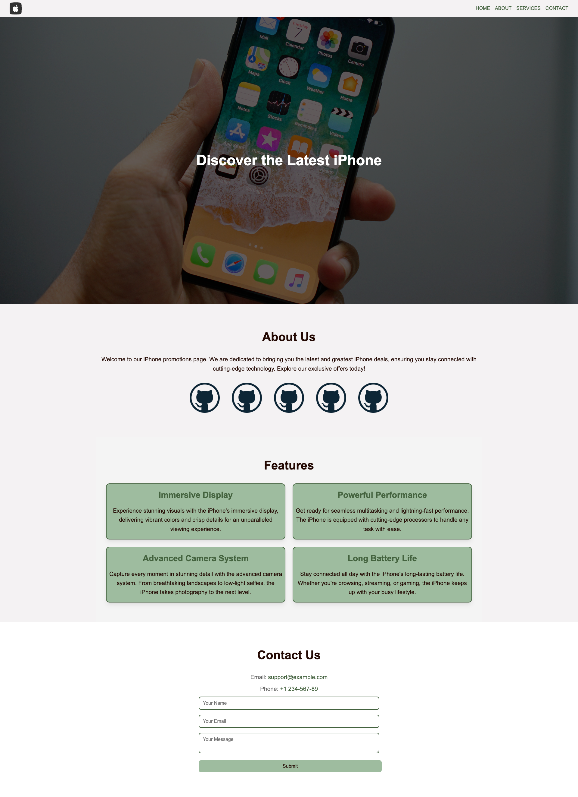

# Theme swticher

**Day 01 - 01.12.2023**

## Description 🎄

As your first task, you will need to take an existing simple website and transform it to add "theme-swtich". Depending on the selected theme, the colors of the website should change. You need to add a functional element to change the selected theme (button/switch/link/etc.), think how you will handle the switching of the colors inside your styles and adjust the design.

Under `/resourcess` you will find your prepared html and css files. Use these as your sceleton - you can add and change anything in the page.

The current color pallete is based on this one here - https://coolors.co/230903-44633f-9ebc9f-d3b88c-f4f2f3 . Your task is to not only add functional-wise a theme switcher, but also to adjust the overall theme. The new colors are "Christmas" themed and available here - https://coolors.co/palette/da2c38-226f54-87c38f-f4f0bb-43291f . You need to be creative and decide yourself how and what you will change regarding the colors. Feel free to choose any other theme, but try to keep it "festiv" 🎅.

## Hints 💡
- Think about using css variables
- Here's a really good article (and video) on the topic [Adam Argyle - Building a theme switch component](https://web.dev/articles/building/a-theme-switch-component)

