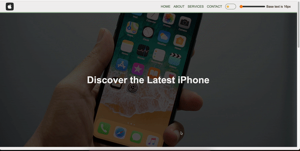

# Scrolling progress

**Day 03 - 05.12.2023**

## Description 🎄
As a last addition to our simple website we want to add an indicator how far we have scrolled into our page - a scroll progress. You can see a preview bellow :)

**Requirements**
- Create a scroll progress component that's attached under the navigation
- Make the navigation and scroll progress to always be visible when scrolling on the page
- The progress bar should be updated as you scroll up and down the page and correctly show fully empty and filled state
- Use simple eventListener for the scrolling, but analyze how many time the event is fired/triggered and think about how you can optimze this

**Hints**
- Think about "optimizing" the updates - debounce or a throttle may be an interesting addition

## Preview

