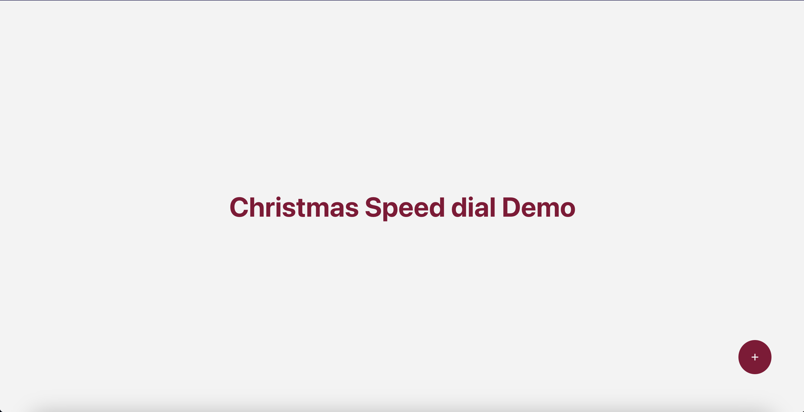
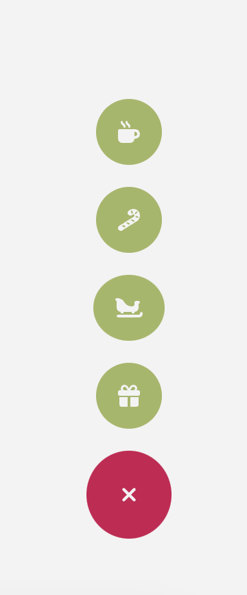

### Speed Dial 

**Day 5 - 07.12.2023**

## Description

For today's challenge you need to create a speed dial component just like in MUI or PrimeReact. Here's our inspo:
- https://mui.com/material-ui/react-speed-dial/
- https://primereact.org/speeddial/

## Requirements

- Use your imagination and make your own SpeedDial button from scratch. In the end it is just a simple `<button></button>`, which shows a few more action elements on hover.
- The dial button should be able to be positioned in any corner of your window (top/left/right/bottom) or centered. Configure your SpeedDial component in a way, where the position can be intuitivly set. 
- The button should be triggered both by hover and by click, for example a hover-in will show the options, but clicking after that it should be closed.
- To make it more "christmassy" you can use the color pallete from the example https://colorhunt.co/palette/860a35af2655a3b763f3f3f3 (or any other color palette of choice).
- Our element should receive an array of actions. These can be the standard print/copy/share or something festive of your choice. After clicking on an action the SpeedDial should be closed.
  
## Hints
- for the icons you can setup FontAwesome in you project and one of the free icon packages: https://fontawesome.com/docs/web/use-with/react/

