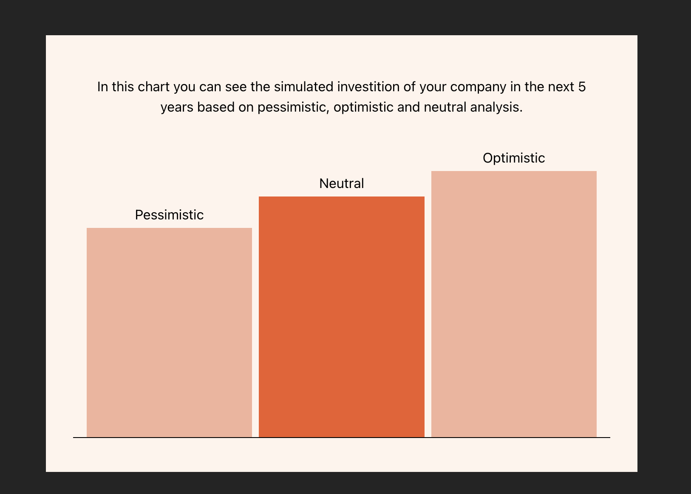

# CSS Bar Chart

**Day 07 - 11.12.2023**


## Description 🎄
You need to create a "simple" bar chart, but using only React and CSS/SCSS/Tailwind/etc., so in short - a custom BarChart component.

**Requirements**
- You will accept an array of 3 values, representing our data - `const inputData = [11008.61, 13230.49, 9615.07];`
- The chart should show the data in 3 bars in ascending order and should be visualized in such a way, that the biggest number is 100% of the chart (the height of the bar) and all other bars are proportional to that bar.
- At the top of the chart add labels for the type of the chart - `"pessimistic", "neutral", "optimistic"`. The label should be positioned at the top of each corresponding bar
- You will need to use only React and styles (any kind - vanilla css,scss,taiwlind, whatever) to create the bars
- Additionaly add a way to show the "selected" option from the chart - the selected bar should have a different color and when clicking on the bars, you should be able to change the selection


## Examples

- These colors are used in the demo
```
--clr-primary: #f05b28;
--clr-primary-light: #f4b29b;
--clr-secondary: #fff4ec;
```


