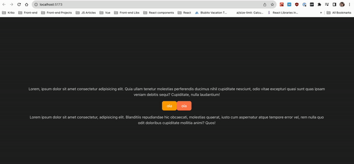

# Confirm Popup

**Day 08 - 12.12.2023**

## Description 🎄
You need to create a `<ConfirmPopup> ... </ConfirmPopup>` component, that can wrap around any element you want and when the element is clicked - we see a confirm pop-up above it.

**Requirements**
- Create `<ConfirmPopup>` that can accept any other element and component
- Make it so that the component can accept a function that's triggered when accept is clicked
- Add options to the component to be able to customize it's text or to trigger specific function on cancel

