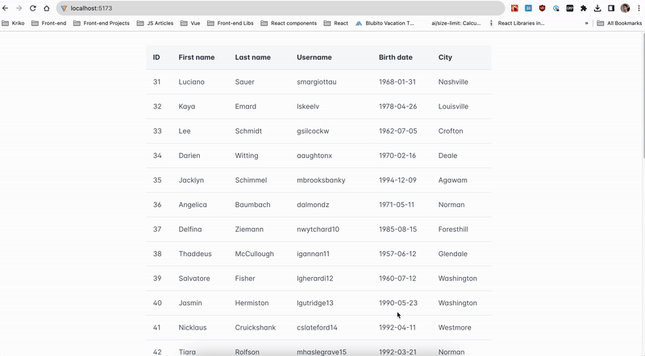

# Fetching data via ReactRouter and ReactQuery

**Day 09 - 13.12.2023**

## Description 🎄
**Preview gif bellow!**

Having to fetch data and show it in a table with pagination and possibly also filters is something everybody has already done or will do pretty soon. But often times we create stores, local state, we bring too many rerenders to something that can be done pretty easily and with couple of "custom" hooks we can make all of our work into couple of lines of code - and the aim of this challenge is exactly this! 

**General requirements**
- You will need to create an app (`react` preferebly) and add routing (`react router`)
- Implement your router to have a single route for home (`/`) - the only page you will need 
- On home page you need to use PrimeReact `<DataTable/>` and `<Paginator />` to visualize your data
- After you have your component for the route, you need to always have 2 query parameters in your URL - `page` and `page_size`. If they don't exist set them to `page=1` and `page_size=10` as default values. If any/all are provided - keep the provided values
- Fetch your data from `dummyjson` API's users - https://dummyjson.com/docs/users
- After you have your initial data and is being displayed you need to connect the pagination logic - whenever you change you page OR page size, you need to update your url/route with these query parameters (`page` or `page_size`)
- After successfull update of the query params, your component should re-fetch the data for the correct page and page size - see dummyjson **Limit and skip users** https://dummyjson.com/docs/users#limit_skip
- After your route is correctly updating your component, let's optimize the loading workflow - add `ReactQuery` and use the URL string to re-trigger fetching when we change our params
- **BONUS** - create a custom hook for reactQuery that accepts a function that returns a Promise (your fetching function) and encapsulates the setup of `useQuery`, the tracking of the url and invalidating the query

## Preview

