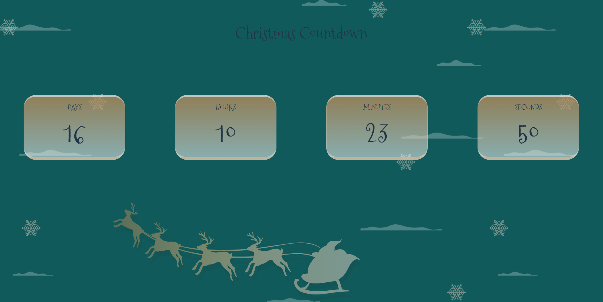
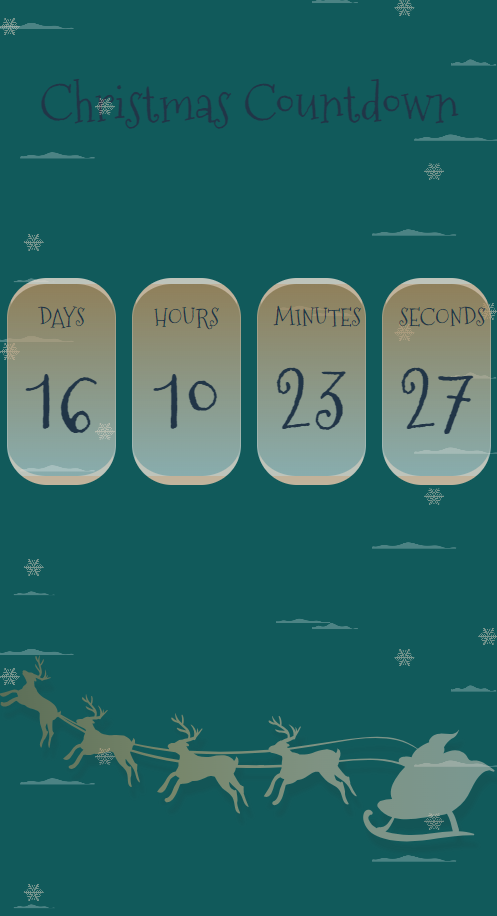
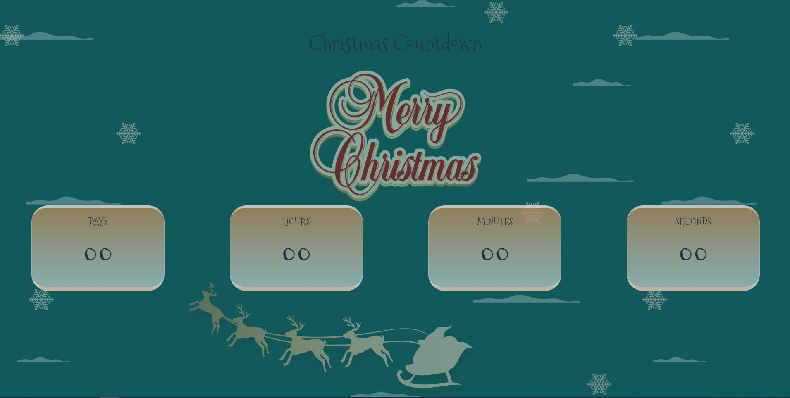
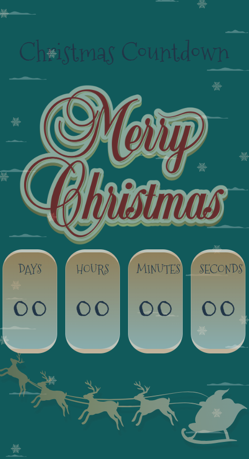

# Christmas Countdown

**Day 10 - 14.12.2023**

## Description

Create a simple web page to display a countdown from the current day & time till Christmas Day.🎄

The countdown should show 4 cards with numbers for:

- Days
- Hours
- Minutes
- Seconds

When the target date arrives, show a festive message to indicate it.

## Fonts:

- font-family: 'Mountains of Christmas', serif;
- free Google Font you can link to your project using the following snippet:

```
<link rel="preconnect" href="https:/fonts.googleapis.com">
<link rel="preconnect" href="https:/fonts.gstatic.com" crossorigin>
<link href="https://fonts.googleapis.comcss2?family=Mountains+of+Christmas&display=swap" rel="stylesheet">
```

## Layout:





## Message:




