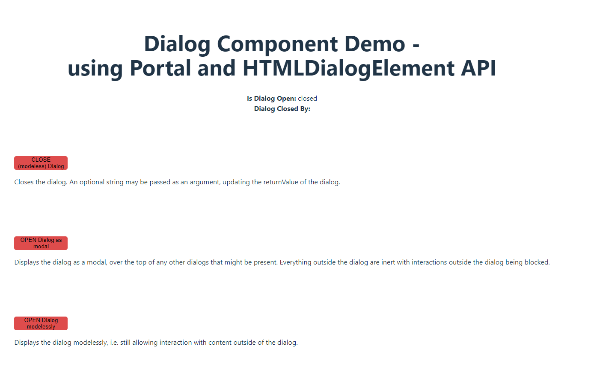

# Dialog component using `<Portal />` and HTMLDialogElement API

**Day 11 - 15.12.2023**

## Description

Create a custom component `<ConfimDialog />` for a dialog element, created with the HTMLDialogElement API and React's `<Portal />`.

## Requirements

- Create a custom component `<ConfimDialog/>`, which should **imitate** the HTMLDialogElement API - https://developer.mozilla.org/en-US/docs/Web/API/HTMLDialogElement

- The component API should contain the following methods:

  1. Instance properties:
     - HTMLDialogElement.open / A boolean value reflecting the open HTML attribute, indicating whether the dialog is available for interaction.
     - HTMLDialogElement.returnValue / A string that sets or returns the return value for the dialog.
  2. Instance methods:
     - HTMLDialogElement.close() / Closes the dialog. An optional string may be passed as an argument, updating the returnValue of the dialog.
     - HTMLDialogElement.show() / Displays the dialog modelessly, i.e. still allowing interaction with content outside of the dialog.
     - HTMLDialogElement.showModal() / Displays the dialog as a modal, over the top of any other dialogs that might be present. Everything outside the dialog is inert with interactions outside the dialog being blocked.

- The dialog should be closable with a close icon, button (cancel) or when clicking outside the dialog
- The dialog should work in 2 modes - `modelessly` and `dialog`
  - `modelessly` - Displays the dialog modelessly, i.e. still allowing interaction with content outside of the dialog.
  - `dialog` - Displays the dialog as a modal, over the top of any other dialogs that might be present. Everything outside the dialog are inert with interactions outside the dialog being blocked.
- Create 3 buttons to trigger and show the dialog with the 2 different modes
  - One to **open** the `dialog` mode
  - One to **open** the `modelessly` mode
  - Another button to **close** the `modelessly` mode & pass a string as an argument, updating the returnValue of the dialog
- To **imitate** the HTMLDialogElement API methods, we want to "expose" `<ConfimDialog/>` methods - i.e. to give access to our `<ConfimDialog/>` internal methods to the parent/container component. For this purpose you will need to use `useImperativeHandle` & `forwardRef`. Bellow you will find an example usage of this in the parent/container component.

**Example**:

```
 const closeDialog = () => {
    if (!dialogRef) return;
    dialogRef.close("Close Btn");
  };

  const showDialog = () => {
    if (!dialogRef) return;
    dialogRef.showModal();
  };

  const showDialogModelessly = () => {
    if (!dialogRef) return;
    dialogRef.show();
  };
  return (
    <>
      <button onClick={closeDialog}>
        CLOSE (modeless) Dialog
      </button>

      <button onClick={showDialog}>
        OPEN Dialog as modal
      </button>

      <button onClick={showDialogModelessly}>
        OPEN Dialog modelessly
      </button>

      <ConfirmDialog
        ref={setDialogRef}
        title={"Confirmation"}
        message={"Are you sure you want to proceed?"}
        btnAcceptText={"Yes"}
        btnDeclineText={"No"}
      />
    </>
  )
```

- Use React's `<Portal />` to insert/append the `<ConfimDialog/>` to the bottom of the `<body/>` element. This means that you can import and use the `<ConfimDialog/>` in any other component and it should be inserted not in the current component, but at the end of the page's `<body/>`

## Hints

- good article on using Portals to create a Modal: https://blog.logrocket.com/build-modal-with-react-portals/
- useImperativeHandle + forwardRef to "expose" its own methods (HTMLDialogElement API): https://react.dev/reference/react/useImperativeHandle


