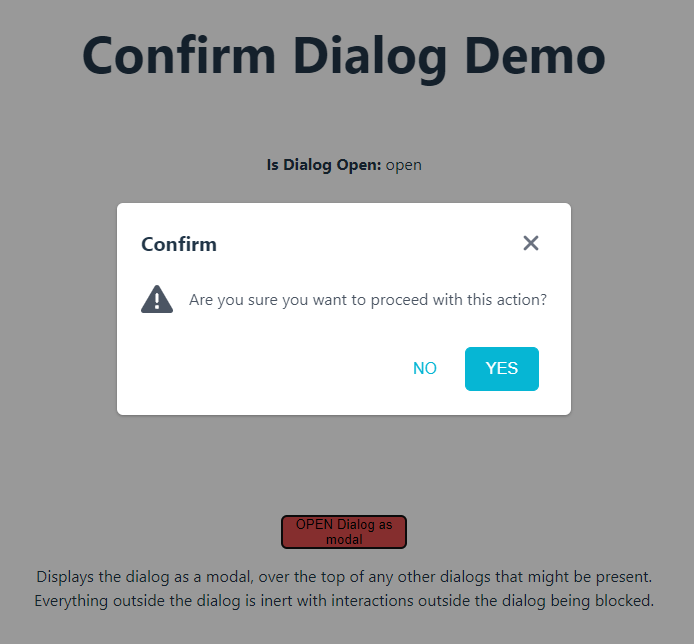
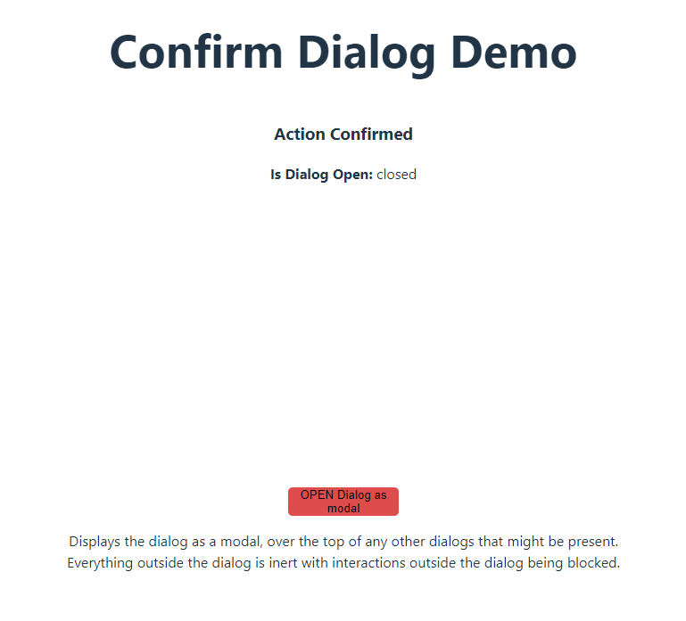

# Confirm Dialog

**Day 12 - 18.12.2023**

## Description 🎄

For today's challenge you need to create a simple modal confirm component, functionally similar to PrimeReact's https://primereact.org/confirmdialog/ . We want to have a single `<ConfirmDialog/>` component that is imported in your `App.tsx`. This component should be able to be controlled and updated from any other part of your app. To accomplish this you need to think about how you can share this information and not use a state-management library (no `MobX`/`Redux`/etc)! Hint - `useContext` and probably a custom hook 🎅

## Requirements

- Create a simple `<ConfirmDialog />` component using the native HTMLDialogElement https://developer.mozilla.org/en-US/docs/Web/API/HTMLDialogElement or reuse the component from Day #11.
  - You should be able to pass and customize the Dialog's `title` (string), `description` (string), `onAccept` (function) and `onCancel` (function)
  - It should always have an `onAccept` function.
  - When no custom `title` and/or `description` is provided, show default values
  - Clicking the "close" button should always close the dialog and trigger `onCancel`, if provided.
  - You need to import ONE global Dialog component that will be displayed when needed in your `App.tsx`.
  - The Dialog component should trigger confirm/decline events, depending on the user's choice.
  - The Dialog should also have a close/'X' button - able to be closed without clicking a Yes/No button.
- To share the controlls and logic for toggle and customizing your Dialog throughout your app, you need to create and implement a custom Context https://react.dev/reference/react/createContext and most probably also a custom hook to store all states.

