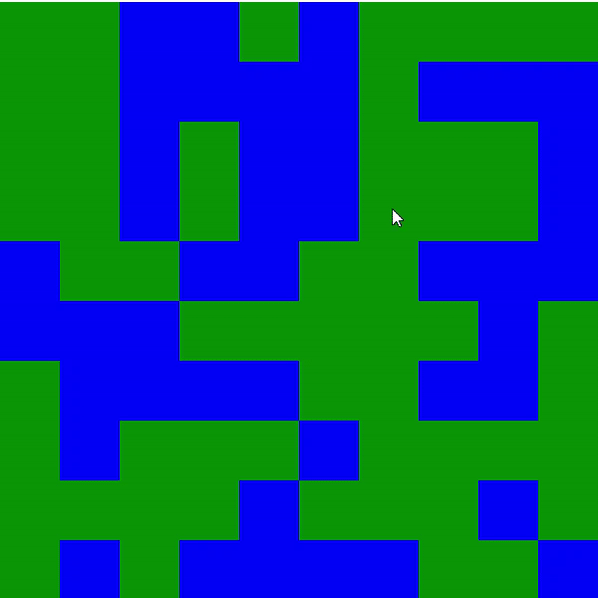

# Spreading fire grid 

**Day 14 - 20.12.2023**

## Description
In this challenge we will create a fire-spreading-simulator called "firestarter".

## Requirements
- Your task is to create a map of 10x10 squares.
- Each square initially is either of type "land" or "water".
- When the user now clicks on a "land" square, a fire starts at that location.
- The fire now spreads to all neighbouring squares (as long as they are of type "land"), and will continue to do that until all "land" connected to the fire is consumed by fire.

### Bonus challenge 1:
Create a button that "resets" the map with a new random map.

### Bonus challenge 2:
Develop the fire spreading in a way that it happens step by step instead of "everything at once". So instead of every connected land tile being on fire immediately, let the fire spreading happen every 0,5 seconds. Step by step.

### Bonus challenge 3:
Animate the spreading of the fire

## Including all bonus challenges, it could look like this

