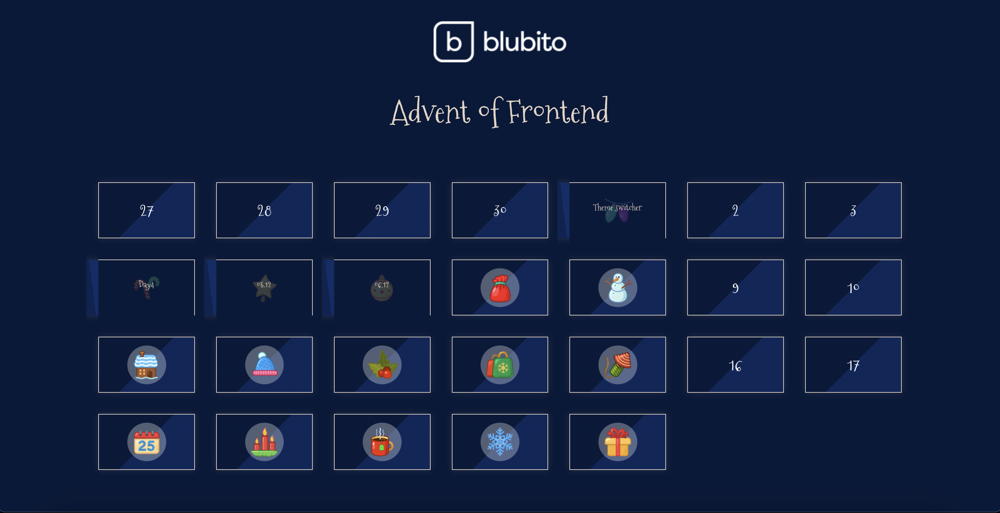
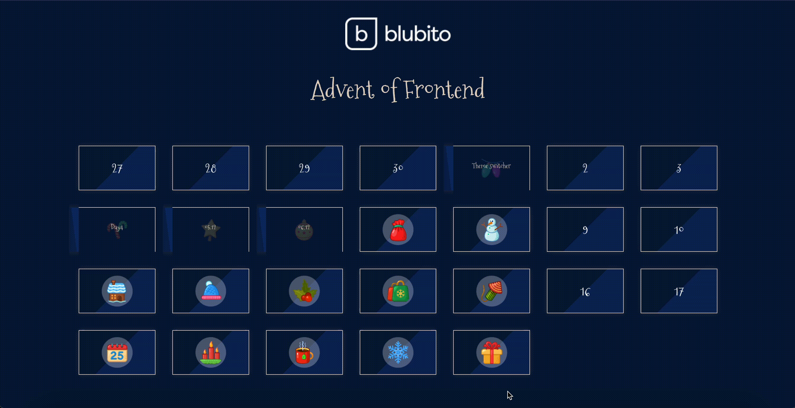

# Advent Calendar

**Day 15 - 21.12.2023**

## Description
Your next challenge for this year's edition of "Advent of Frontend" is to create your own advent calendar. 

## Requirements
- it should show the layout for December 2023
- it should receive an array of events (remember that weekends don't contain any challenges).
- only the current day should be selectable. It should stay open until end of day. (independant of page reloads).
- after clicking on the current day the content of the challenge is revealed with a door opening animation. The name of the challenge is visible and it is linked to the challenge location
- all previous days with challenges should always stay open. 
### BONUS: Calendar should be active only in the month of December 2023

## Hints
- all needed assets are included under the `/resources` folder
- font-family: 'Mountains of Christmas', serif; (it is a free Google Font you can find here: https://fonts.google.com/specimen/Mountains+of+Christmas?query=mountains+of+christmas)
- you can find the used colors in `/resources/colors.scss`

## Design 

## Preview from 07.12.
